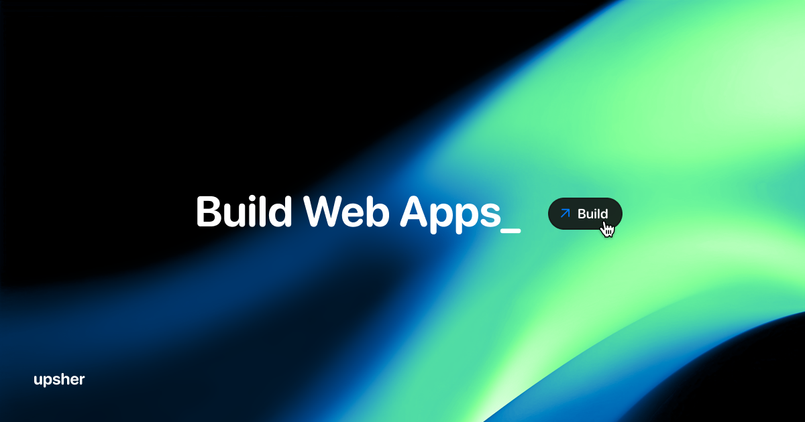

[](https://upsher.dev)

<div align="center">

<a href="https://upsher.dev">Website</a>
<span>&nbsp;&nbsp;•&nbsp;&nbsp;</span>
<a href="https://upsher.dev/w">Writings</a>

<p align="center">
  <a href="https://twitter.com/intent/follow?screen_name=theupsher">
    
  </a>
</p>

</div>

---

# Upsher

Hey, I build functional Web Apps and currently focused on React & NextJS ecoSystem.

_React · Next.js · WebGL · Linux_

## Stack

- **Framework**: [Next.js 15](https://nextjs.org/)
- **Deployment**: [Vercel](https://vercel.com)
- **Styling**: [Tailwind CSS 4](https://tailwindcss.com)
- **Analytics**: [Posthog analytics](https://posthog.com/)

## Running Locally

```sh
git clone https://github.com/theKrishDas/folio
cd folio
npm i
npm run dev
```

Personally, I use [`bun`](https://bun.sh). 🙂

---

[](https://vercel.com)
